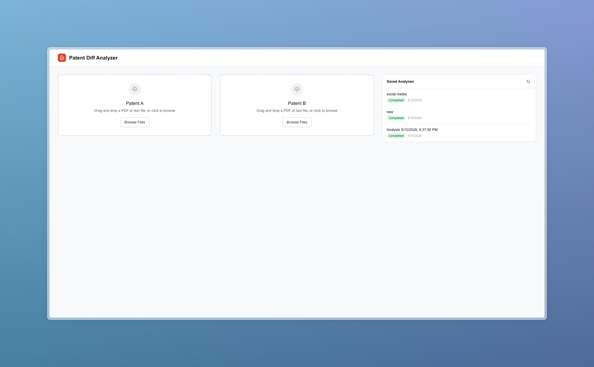
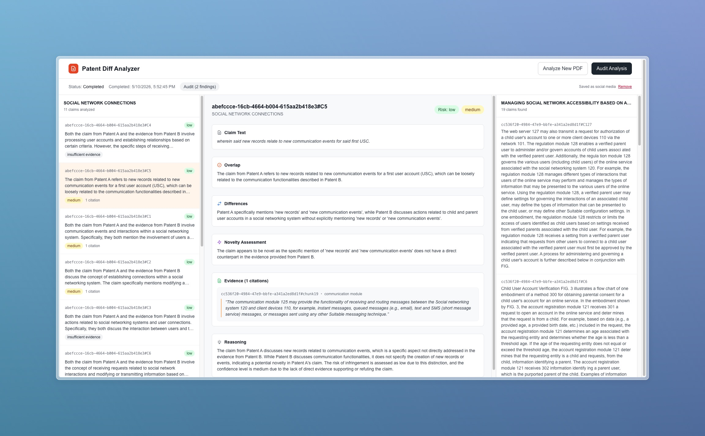
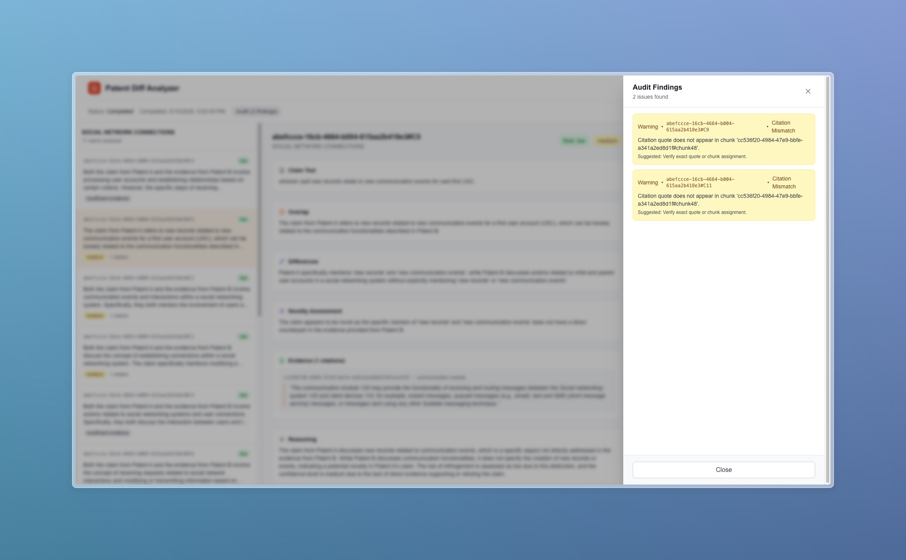

# Patent Diff Analyzer

A tool that compares two patents and produces a structured, citation-backed analysis of overlap, novelty, and infringement risk.

## Screenshots & demo

**Home**



**Analysis**



**Audits**



**Walkthrough video:**

https://github.com/user-attachments/assets/e1bdd07b-c274-43bb-a875-1e4cd3c99695

## Architecture

This is a **directed pipeline with 7 agents**, each outputting strict JSON:

1. **Ingest** — Upload and parse PDF/text documents
2. **Claim Extraction** — Extract and normalize patent claims
3. **Decomposition** — Chunk documents with metadata
4. **Retrieval Planner** — Plan retrieval strategy
5. **Retrieval** — Hybrid vector + lexical search
6. **Matching** — Score and rank candidate matches
7. **Reasoning** — Structured diff with citations
8. **Output Builder** — Format results
9. **Audit** (optional) — Re-validate conclusions

## Tech Stack

- **Backend**: Python (FastAPI)
- **Frontend**: Next.js 14 (React, TypeScript, Tailwind CSS)
- **Vector DB**: PostgreSQL + pgvector
- **Embeddings**: OpenAI text-embedding-3-small
- **LLM**: OpenAI GPT-4o-mini

## Quick Start

### Prerequisites

- Python 3.11+
- Node.js 18+
- Docker (for PostgreSQL + pgvector)
- OpenAI API key

### 1. Clone and Setup

```bash
cd patent-diff-analyzer
```

### 2. Configure Environment

```bash
cp .env.example .env
# Edit .env and add your OPENAI_API_KEY
```

### 3. Start All Services

```bash
./start.sh
```

This will:

- Start PostgreSQL + pgvector in Docker
- Create a Python virtual environment
- Install backend dependencies
- Start FastAPI backend on http://localhost:8000
- Start Next.js frontend on http://localhost:3000

### 4. Access the Application

- **Frontend**: http://localhost:3000
- **API Docs**: http://localhost:8000/docs
- **Health Check**: http://localhost:8000/health

### Manual Start (Alternative)

**Database:**

```bash
cd infra
docker-compose up -d
```

**Backend:**

```bash
python3 -m venv venv
source venv/bin/activate
pip install -r api/requirements.txt
cd api
uvicorn main:app --reload --port 8000
```

**Frontend:**

```bash
cd web
npm install
npm run dev
```

## Usage

1. **Upload Patent A** — Drag and drop or browse for a PDF/text file
2. **Upload Patent B** — Upload the second patent
3. **Run Analysis** — Click "Run Analysis" to start the pipeline
4. **Review Results** — Three-panel interface:
   - **Left**: Patent A claims list with risk/confidence badges
   - **Center**: Detailed diff view with overlap, differences, novelty, citations
   - **Right**: Matched claims from Patent B
5. **Audit** — Click "Audit Analysis" to re-validate conclusions

## Project Structure

```
patent-diff-analyzer/
├── api/                    # FastAPI backend
│   ├── main.py            # App entry point
│   ├── routers/           # API route handlers
│   │   ├── documents.py   # Upload endpoints
│   │   ├── analysis.py    # Analysis endpoints
│   │   └── audit.py       # Audit endpoints
│   └── services/          # Business logic
│       ├── ingestion.py   # Document processing
│       ├── chunking.py    # Text chunking
│       ├── claim_extraction.py
│       ├── retrieval.py   # Vector + lexical search
│       ├── analysis.py    # LLM reasoning
│       └── audit.py       # Audit validation
├── core/                  # Shared core modules
│   ├── schemas.py         # Pydantic data models
│   ├── config.py          # Settings
│   ├── database.py        # SQLAlchemy + pgvector
│   └── observability.py   # Logging, request IDs, timers
├── web/                   # Next.js frontend
│   ├── src/app/           # App router
│   ├── src/components/    # React components
│   │   ├── DocumentUploader.tsx
│   │   └── AnalysisPanel.tsx
│   └── src/types/         # TypeScript types
├── infra/                 # Infrastructure
│   └── docker-compose.yml # PostgreSQL + pgvector
├── workers/               # Background job workers (future)
├── assets/sample_patents/ # Sample patent PDFs
├── .env.example           # Environment template
└── start.sh              # One-command startup
```

## API Endpoints

### Documents

- `POST /api/v1/documents/upload?label=Patent+A` — Upload a document
- `GET /api/v1/documents/{document_id}` — Get document details

### Analysis

- `POST /api/v1/analysis/start` — Start analysis (accepts `{patent_a_id, patent_b_id}`)
- `GET /api/v1/analysis/{job_id}` — Get analysis status and results

### Audit

- `POST /api/v1/audit/{job_id}` — Run audit on completed analysis

## Data Contracts

Key schemas defined in `core/schemas.py`:

- `Document` — Processed patent document
- `Claim` — Structured claim with metadata
- `Chunk` — Text chunk with embeddings
- `DiffResult` — Analysis output per claim
- `Citation` — Evidence citation (source, quote, chunk_id)
- `AuditFinding` — Audit validation result

## Citation Rules

Every conclusion must include:

- Source document ID and label
- Exact quote from the text
- Chunk ID and section location

If evidence is weak, output must say "insufficient evidence" — never hallucinate a citation.

## Design Principles

- **Three-panel UI**: Left (Patent A claims), Right (Patent B matches), Center (diff view)
- **Evidence-first**: Show citations before conclusions
- **Visible uncertainty**: Low confidence badges, "insufficient evidence" labels
- **Accent color**: Orange/red used sparingly (90% neutral)

## Development

### Running Tests

```bash
cd api
pytest
```

### Adding a New Service

1. Add service module in `api/services/`
2. Add router in `api/routers/`
3. Include router in `api/main.py`
4. Update `core/schemas.py` if data contracts change

## License

MIT
